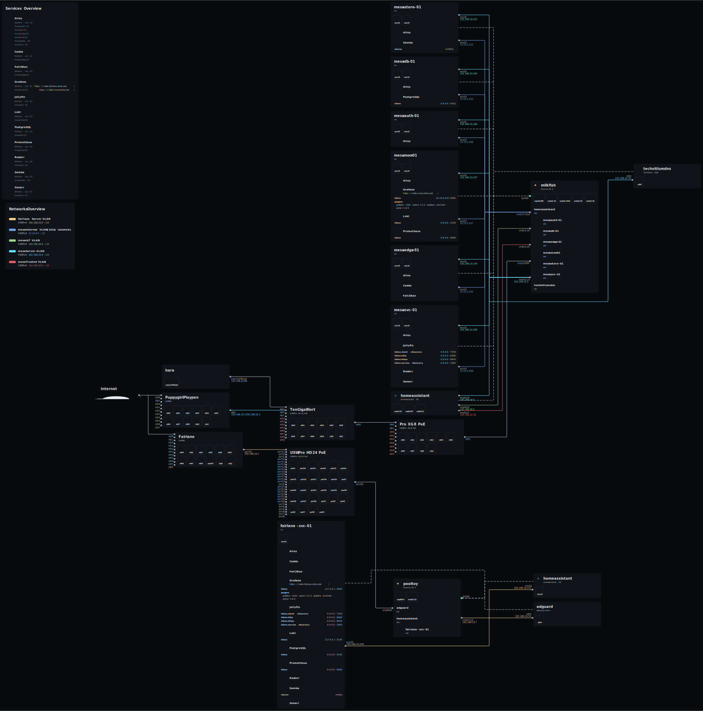

# ❄️ nix-config

## 🌟 modules

programs and/or their `home-manager` configuration, auto-discovered from `modules/` by haumea and exposed as `modules.<name>.<file>`

each module contains `system.nix`, `home.nix`, or both

enable by importing `modules.<name>.[system|home]` into the host's corresponding config file

files and directories prefixed with `_` are treated as internal (haumea convention)

## 🔧 quirks

machine-specific configuration that doesn't fit as a module - hardware config, drive mounts, peripheral workarounds

lives in `quirks/<hostname>/`, passed to the host as a `quirks` specialArg (wired in `flake.nix`)

## 📦 pkgs

every `.nix` file in `pkgs/` is exposed as `pkgs.<filename>` via nixpkgs' `lib.packagesFromDirectoryRecursive`, using `callPackage`

## topology

